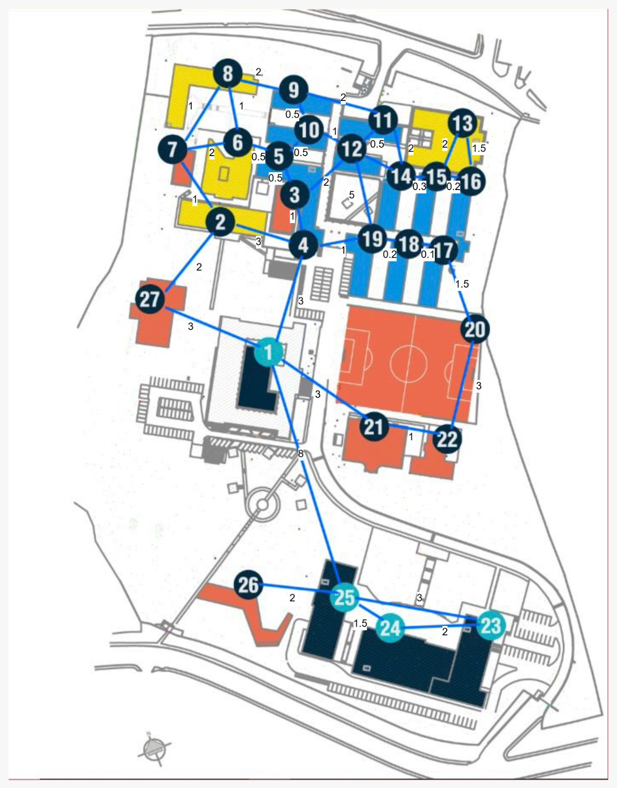

# GESTIONANDO EFICIENTEMENTE LA MEMORIA

---

## JUAN MANUEL URREGO LONDOÑO  
## SAMUEL CHICA JIMÉNEZ

---

### ASIGNATURA: ESTRUCTURA DE DATOS  
### DOCENTE: OSCAR LEONEL SANCHEZ  
### CURSO: TECNOLOGÍA EN DESARROLLO DE SOFTWARE

---

# INSTITUCIÓN UNIVERSITARIA PASCUAL BRAVO
## MEDELLÍN
## 2026

---

# Descripción del problema y Motivación

El campus universitario está compuesto por múltiples edificios (bloques de aulas, laboratorios, zonas deportivas, administrativos, estacionamientos) que están interconectados por una red de caminos, pasillos y zonas peatonales. Para un estudiante nuevo o un visitante, encontrar la ruta más eficiente entre dos puntos puede ser un desafío.

El problema consiste en abstraer toda esta infraestructura física del campus a una estructura de datos formal que permita calcular las rutas más óptimas.

El proyecto busca optimizar la movilidad universitaria reduciendo tiempos de traslado y mejorando la seguridad mediante rutas de evacuación y una mejor gestión del flujo de personas.

---

# Modelado del problema con diagrama del grafo

## Representación visual del campus

figura 1

La figura muestra la representación del campus universitario como un grafo ponderado no dirigido, donde cada nodo representa un bloque o ubicación y cada arista representa una conexión física entre ellos con un peso asociado.

### Nodos / Vértices (V)
Representan los números de cada bloque.

### Aristas / Enlaces (A)
Vías de comunicación físicas (caminos, pasillos, conexiones).

### Dirección
Proponemos un grafo no dirigido(bidireccional), ya que la gran mayoría de los caminos peatonales en un campus se puede transitar en ambos sentidos.

### Pesos
Los pesos de las aristas representan los tiempos de desplazamiento.

---

# Estructuras de datos utilizadas: representación del grafo y arreglos auxiliares con su justificación

## Representación principal del grafo

figura 2

Para almacenar los 27 bloques y sus conexiones (aristas), la estructura ideal es una lista de adyacencia (implementada comúnmente mediante un diccionario de listas o un arreglo de listas enlazadas)

---

## Justificación

El campus tiene 27 vértices ( V =27 ). Si estuviera completamente conectado, tendría cerca de 350 aristas. Sin embargo, al contar sus conexiones actuales, el número de aristas ronda las 35 - 40. Al ser un grafo disperso (aquel en el que el número de aristas es menor que el número máximo posible de conexiones que podrían existir entre sus vértices), La lista de adyacencia consume solo O(V+ E) de memoria, evitando el desperdicio de espacio que provocaría una Matriz de Adyacencia repleta de ceros.

Rapidez de iteración: Algoritmos de búsqueda de caminos (como Dijkstra o BFS) necesitan conocer frecuentemente cuáles son los vecinos directos de un nodo actual. La lista de adyacencia permite acceder a esta información en tiempo óptimo $O(1)$ para encontrar la lista, e iterar directamente sólo sobre los nodos conectados.

---

# Estructuras de datos utilizadas

## Representación del grafo: Lista de adyacencia

Se utiliza un diccionario de python (self.grafo) donde las claves son los identificadores de los nodos (enteros) y los valores son listas de tuplas (vecino, peso).

## Cola de Prioridad (Min-Heap)

Módulo heapq de Python que gestiona una lista de tuplas (distancia_acumulada, nodo); permite extraer el nodo con la menor distancia estimada en tiempo O(logV), evitando tener que buscar linealmente en toda la lista de nodos.

## Arreglos/Estructuras Auxiliares (en Dijkstra)

### Diccionario de Distancias (dist)
Guarda la menor distancia conocida desde el origen a cada nodo. Se inicializa en infinito (float(‘inf’). Permite el acceso y actualización en O(1).

### Diccionario de Padres (padre)
Registra el nodo predecesor en el camino óptimo. Esencial para reconstruir la ruta hacia atrás en tiempo lineal una vez alcanzado el destino.

---

# Operaciones Implementadas y Complejidad

## Gestión de archivos

- **cargar_desde_archivo() y grafo_real():** Inicializan el grafo O ( V + E )
- **guardar_en_archivo():** Convierte el grafo a JSON y lo escribe en el disco O ( V + E )

## Ubicaciones y Rutas

- **agregar_ubicacion(nodo):** Ande una nueva clave vacía al diccionario O ( 1 )
- **eliminar_ubicacion(nodo):** Elimina el nodo y recorre todos los demás para borrar las conexiones hacia él O ( V + E )
- **agregar_ruta(origen, destino, peso):** Verifica el nodo y recorre todos los demás para borrar las conexiones hacia él O( K ) (k es el número de vecinos)
- **eliminar_ruta(origen, destino):** Filtra las listas de adyacencia de ambos nodos para remover la conexión O( K )

## Algoritmo central

(imagen funcion del código)

- **ruta_mas_corta(inicio, fin):** Implementacion de Dijkstra (complejidad temporal O(( V + E)log V) (complejidad espacial O(V) para almacenar los diccionarios auxiliares) (dist y padre).

## Visualización

- **mostrar_lista_adyacencia:** Recorre y formatea el grafo O(V log V + E ) debido al ordenamiento de las claves.
- **mostrar_matriz_adyacencia():** Construye temporalmente una matriz bidimensional del tamaño V x V para imprimirla en consola O ( V2 + E).

---

# Instrucciones para ejecutar el código

## Requisitos previos

Para ejecutar el sistema de rutas del campus, se necesita tener instalado Python en su versión 3.7 o superior. El programa utiliza exclusivamente módulos de la biblioteca estándar de Python, incluyendo json para la carga y guardado de datos, heapq para implementar la cola de prioridad necesaria en el algoritmo de Dijkstra, y os para el manejo de archivos. Esto significa que no requiere la instalación de ninguna librería externa adicional.

## Estructura de archivos necesaria

El proyecto requiere únicamente dos archivos principales: el archivo punto.py que contiene el código fuente del programa, y el archivo grafo.json que almacena los datos del grafo. Este último archivo se genera automáticamente la primera vez que se ejecuta el programa si no existe, por lo que el usuario no necesita crearlo manualmente. Ambos archivos deben ubicarse en la misma carpeta para que el programa funcione correctamente.

## Ejemplo de uso

---

# Limitaciones actuales

La solución actual presenta varias limitaciones importantes. En primer lugar, los nodos del grafo deben ser números enteros si o si, lo que impide utilizar nombres descriptivos como "Biblioteca" o "Taller". Esto hace que el sistema sea menos intuitivo para usuarios no familiarizados con la numeración asignada a cada ubicación. En segundo lugar, el grafo se carga completamente en memoria RAM, lo que puede generar problemas si el campus es muy grande y contiene más de cien mil nodos, ya que consumiría una cantidad excesiva de memoria.

Otra limitación significativa es que los pesos de las aristas son estáticos y no cambian con el tiempo. En un campus real, las rutas pueden tener diferentes tiempos de recorrido según la hora del día debido a la congestión de estudiantes, o pueden cerrarse temporalmente por obras de mantenimiento. El sistema actual no puede manejar estas variaciones temporales. Además, cada vez que se consulta la ruta más corta entre dos puntos, el algoritmo recalcula todo desde cero, lo que resulta ineficiente cuando se realizan consultas repetitivas sobre las mismas rutas.

El algoritmo utilizado es Dijkstra estándar, que explora el grafo en todas direcciones sin utilizar ninguna heurística que lo guíe hacia el destino. Esto funciona correctamente pero es menos eficiente que algoritmos como A* cuando se conocen las coordenadas geográficas de las ubicaciones. El sistema tampoco considera restricciones de accesibilidad, como la presencia de escaleras que podrían ser problemáticas para personas con movilidad reducida, o la iluminación de las rutas para recorridos nocturnos.

---

# Posibles mejoras

Para potenciar este proyecto aún más, la mejora más urgente y con mayor impacto en su usabilidad sería permitir que el sistema entienda nombres reales de lugares mediante un diccionario que mapee los números actuales a etiquetas como "Biblioteca " o "Bloque de Ingeniería", haciendo que la aplicación sea muchísimo más amigable para cualquier estudiante.

En la parte técnica y de rendimiento, se podría implementar de forma muy sencilla un sistema de caché con el decorador lru_cache de Python para que el programa "recuerde" las últimas 128 rutas consultadas y dé respuestas instantáneas sin tener que recalcular todo desde cero.

Además, si quisiéramos manejar millones de nodos sin reventar la memoria RAM, la solución ideal sería migrar los datos del archivo JSON a una base de datos local y ligera como SQLite, la cual permite usar índices para acelerar las búsquedas y consultas sin complicaciones.

Finalmente, las mejoras que cerrarían el proyecto con broche de oro serían visuales y de conectividad: primero, diseñar una interfaz gráfica interactiva con Tkinter donde el usuario pueda ver el mapa real, hacer clic en los bloques y ver la ruta resaltada en color; y segundo, añadir la opción de exportar el camino a formatos estándar como GPX o KML, permitiendo que cualquier estudiante descargue la ruta en su teléfono y la abra directamente en Google Maps para guiarse paso a paso mientras camina por la universidad.

